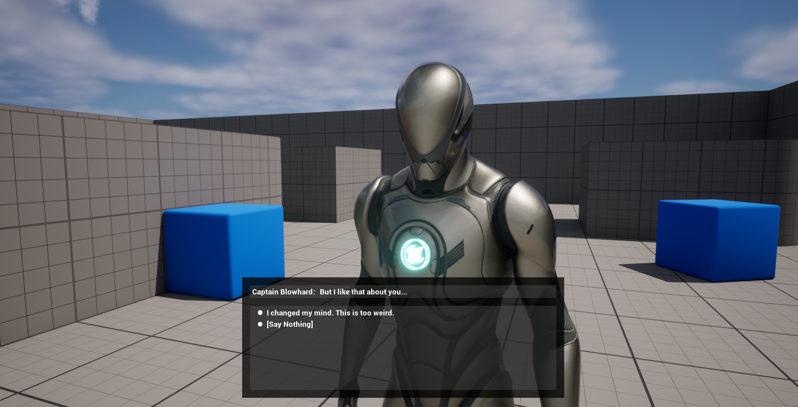

**Click [here](../index.markdown) to return to the Unraed Docs home page.** 

# Dialogue Tree: Introduction and Overview
## What is Dialogue Tree?
Dialogue Tree is a plugin for Unreal Engine 5 that allows you to design and play conversations between the player and NPCs. It aims to be quick to set up, easy and fun to work with, and flexible enough that you can extend it to suit any vision you have for your project.

## Contents 
1. [**Quick Links**](DialogueTree.md#quick-links)
2. [**Help & Support**](DialogueTree.md#help-&-support)
3. [**State of the Plugin**](DialogueTree.md#state-of-the-plugin)
4. [**Why Dialogue Tree?**](DialogueTree.md#why-dialogue-tree)
5. [**Why Not Dialogue Tree?**](DialogueTree.md#why-not-dialogue-tree)
6. [**Conclusion**](DialogueTree.md#conclusion)
7. [**Quick Statistics**](DialogueTree.md#quick-statistics)

## Quick Links
1. [**Guides and Tutorials**](Tutorials/Contents.md)
2. [**Documentation**](Documentation/Contents.md)
3. [**Roadmap**](Roadmap.md)
4. [**Changelog**](Changelog.md)

## Help & Support
You can reach me for questions and support at unraedgames@gmail.com, or on the plugin's [**Discord Channel**](https://discord.gg/mf7mGXbePB). Feel free to reach out with any questions or requests. 

If you're enjoying the plugin, please take a few moments out of your day to leave me a review on the [**Unreal Marketplace**](https://www.unrealengine.com/marketplace/en-US/product/dialogue-tree). 

If you would like to support further development on the project you can do so on [**Patreon.com**](patreon.com/UnraedGames). 

## State of the Plugin 
The plugin is currently in a stable and useable state, with some quality of life features in development. Below you will find a more detailed look at the plugin in its current state, but here are some highlights of the major features:

- Expansive and visually appealing graph editor 
- Quick and simple setup 
- Customizable and fun to work with
- Highly compatible
- Extensive documentation, with detailed tutorials to get you started 

## Why Dialogue Tree? 
There are a lot of great dialogue plugins out there, so why would you choose this one? 

To start with, Dialogue Tree features an expansive, flexible, and visually appealing graph editor. This makes it easy to set your dialogues up, easy to customize the flow of dialogue in your project, and fun to play around with. 

Set up is quick and easy, without sacrificing customizability. Most dialogue in games follows one of two patterns: the “standard” dialogue of games like *Skyrim*, *The Outer Worlds*, and *The Witcher*, or the CRPG model followed by games like *Divinity: Original Sin 2* and *Pillars of Eternity*. If that’s what you’re looking for, Dialogue Tree includes templates for each of those setups. Just customize the widget visually and plug it in. Need something more bespoke? The plugin offers several extension points to create your own Dialogue Controller or presentation template in Blueprint. 

The plugin is also designed to be extremely compatible with other plugins and systems. You should be able to drop it into pretty much any project. 

Finally, Dialogue Tree is extensively documented, including several detailed tutorials to get you started. Tutorials are available in both text and video formats, and currently cover the following topics: 

1.	[**Quick Start**](Tutorials/QuickStart.md)
2.	[**Dialogue Editor Guide**](Tutorials/EditorGuide.md)
3.	[**Queries and Events**](Tutorials/QueriesAndEvents.md)
4.	[**Customizing Dialogue**](Tutorials/Customization.md) 

If you want to get a better feel for how the plugin works, I highly recommend you check these out. 

## Why not Dialogue Tree?
All right then, why might Dialogue Tree not be for you? 

First, you may simply not like the design choices I made, which is completely fair. I encourage you to look at the tutorials linked above to see how everything fits together, and if this solution is a good fit for your needs. 

Second, and more importantly, networked multiplayer dialogue is not yet in the plugin. I do plan to create a Dialogue Controller that does this, but there are several smaller quality-of-life features I want to add first. For the moment, if multiplayer dialogue is something you need, this is not the plugin for you. Check back later, and that may have changed. 

Finally, I am currently only supporting Windows as a platform, though I will happily consider adding other platforms in future if there is enough interest. 

## Conclusion 
I had a number of fairly lofty goals when I set out to make this plugin. I wanted to make a dialogue plugin that was fun and easy to use, that would make setup quick without sacrificing customizability, and that could be molded to fit the user's vision rather than the other way around. Did I succeed in that? I hope so, but ultimately that's for you to decide.

I would love to hear what you think. Does something work particularly well or poorly for you? Is there something I should change, a tutorial I should make, or a feature I should add? Let me know. In the meantime, best of luck and happy developing.

## Quick Statistics 
These are the same statistics about the plugin's contents that Epic asks to list on their store page: 

- Number of Blueprints: 10
- Number of C++ Classes: 67
- Supported Development Platforms: Win64
- Supported Target Build Environments: Win64
(Support for further platforms will be considered in future if there is sufficient interest)

