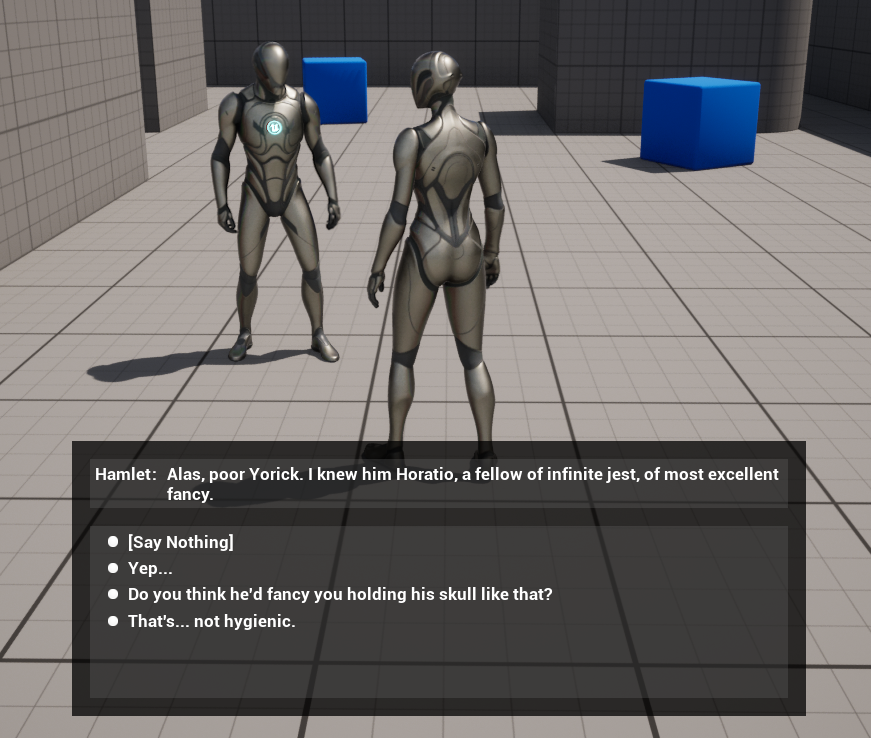
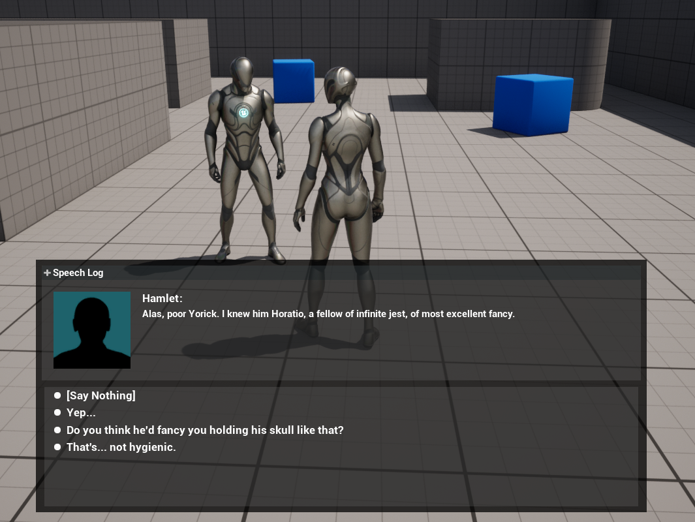
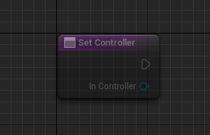
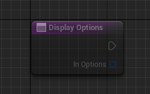
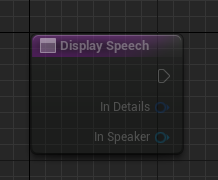
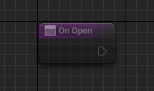
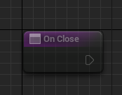

**Click [here](Contents.md) to return to table of contents.** 

# Dialogue Tree: Dialogue Display Widget
Display widgets are a semi-optional element of the dialogue workflow. These are used by the default/basic [**dialogue controller**](DialogueController.md) to stipulate the actual appearance of dialogue. The user is free to use/customize the provided display widgets, to create their own, or - if making their own dialogue controller - to come up with their own alternative. 

## Contents 
1. [**Changing the Display Widget**](DialogueDisplayWidget.md#1-changing-the-display-widget)
2. [**Provided Display Widgets**](DialogueDisplayWidget.md#2-provided-display-widgets)
   * [**Basic Dialogue Display**](DialogueDisplayWidget.md#basic-dialogue-display)
   * [**CRPG Dialogue Display**](DialogueDisplayWidget.md#crpg-dialogue-display)
3. [**Creating a Custom Display Widget**](DialogueDisplayWidget.md#3-creating-a-custom-display-widget)

## 1. Changing the Display Widget 
The display widget used by your project is determined by the Basic Dialogue Controller. You can set any UMG widget as your display widget by changing the basic controller's "widget type" property in blueprint and calling the "Initialize" function. **The chosen UMG widget must implement the [BI_SimpleDialogueDisplay interface](DialogueDisplayWidget.md#3-creating-a-custom-display-widget), or it will do nothing.** 

If no widget type is set via blueprint, the Display Widget will use the default value (Basic Dialogue Display). You can also change the type of widget used by setting the default value of "widget type" directly in the controller's blueprint. 

## 2. Provided Display Widgets 
Two display widgets are provided with the plugin: 
 

### Basic Dialogue Display 
The standard dialogue display that will be applicable to most projects. This creates basic dialogue somewhat like the dialogue widgets in Skyrim, the Witcher and the Outer Worlds. More specifically, it presents an NPC speech and a list of options to choose from. 
 

### CRPG Dialogue Display 
A specialized display widget specifically for CRPG type games. Includes the same functionality as the Basic Dialogue Display widget, but adds portraits and a speech log. 

Please note that CRPG Speaker Components should be used alongside this widget. Otherwise you will be unable to specify portraits to display. In such cases the CRPG Dialogue Display widget will use a generic silhouette portrait. 

## 3. Creating a Custom Display Widget 
While the above display widgets will work with some aesthetic tweaking for most projects, some users will doubtless want to create their own custom widgets. To do so, create a new User Widget and make it implement the BI_SimpleDialogueDisplay interface. You will want to implement that interface's methods, which include: 

- **Set Controller** takes a Dialogue Controller and allows you to cache the controller for your widget. 

- **Display Options** takes an array of [**Speech Details**](FSpeechDetails.md) structs. It controls how speech options are presented to the player to select from. 

- **Display Speech** takes a [**Speech Details**](FSpeechDetails.md) struct and a [**Speaker Component**](DialogueSpeakerComponent.md). It controls how a speech is displayed to the widget. 

- **On Open** allows you to specify behaviors to preform on opening the widget. 

- **On Close** allows you to specify behaviors to preform on closing the widget. 

