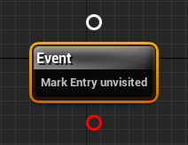
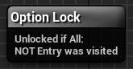

**Click [here](Contents.md) to return to table of contents.** 

# Dialogue Tree: Dialogue Nodes
This page serves as a list of the different dialogue nodes and their relevant properties. 

## Contents 
1. [**Entry Node**](DialogueNodes.md#entry-node)
2. [**Speech Node**](DialogueNodes.md#speech-node)
3. [**Branch Node**](DialogueNodes.md#branch-node)
4. [**Event Node**](DialogueNodes.md#event-node)
5. [**Jump Node**](DialogueNodes.md#jump-node)
6. [**Option Lock Node**](DialogueNodes.md#option-lock-node)

## Entry Node
Serves as an entry point into the graph. Does nothing else and has no editable properties.

## Speech Node 
Node that plays a speech. The workhorse of any dialogue.

**Properties:**
  * **Speaker:** Allows you to select the speaking role in dialogue to associate with the speech. Will be matched to the appropriate Speaker Component on playing dialogue.
  * **Speech Title:** Customizeable name/ID for the speech. Purely cosmetic.
  * **bIgnoreContent:** Whether the speech's text and audio content should be force skipped/ignored. Primarily useful for "continue" buttons and similar speech options we do not want to actually play. False by default.
  * **Speech Text:** The textual content of the speech.
  * **Speech Audio:** The audio content of the speech.
  * **Minimum Play Time:** The minimum amount of time for the speech to display for if not skipped. 0.0f by default. 
  * **bCanSkip:** Whether the player is allowed to skip this speech. True by default.
  * **BehaviorFlags:** Custom data tags associated with the speech. Can be used to help trigger animations, or in any other case where additional information about a speech is necessary. Structured as an FGameplayTagContainer. 
  * **TransitionType:** The type of [**transition**](SpeechTransitions.md#speech-transitions) the the speech uses. Auto-transitions play all node content and then proceed immediately to the next node in the chain. Input transitions present a list of options from among the node's children and wait for the player to select one before continuing.

## Branch Node
Node that branches according to an if/else condition. 

**Properties:**
 * **bIfAny:** Whether the node evaluates to true if any single condition does, or if all conditions must evaluate to true for the node as a whole to do so.
 * **Conditions:** List of [**Dialogue Conditions**](DialogueCondition.md) associated with the node.

## Event Node
Node that plays a list of [**Dialogue Events**](DialogueEvent.md). 

**Properties:**
 * **Events:** The list of Dialogue Events to play.

## Jump Node
Node that redirects the flow of dialogue to a specified target node. Useful for highly interconnected dialogues or simply for maintaining neatness 
when reverting control to earlier points in dialogue. 

**Properties:**
 * **JumpTarget:** The node we wish to "jump" control of dialogue to. 

## Option Lock Node
Node that serves a conditional filter for a single dialogue option. Attempting to traverse the node directly simply transfers control on to its child -- in other words, the node only has an impact when placed after a speech node with an input transition. Attempting to retrieve the node as an option has the following outcomes:

- If the conditions succeed, the child node is displayed as an option in its normal "unlocked" state.
- If the conditions fail, the child node is displayed as a "locked" option. Such an option is unselectable. Moreover, when used with the default controller/widgets the option button itself will be greyed out and disabled. 

**Properties:**
 * **bIfAny:** Whether the node evaluates to true if any single condition does, or if all conditions must evaluate to true for the node as a whole to do so.
 * **Conditions:** List of [**Dialogue Conditions**](DialogueCondition.md) associated with the node.
 * **Locked Message:** Optional FText message to display when the option is locked. For example, "Mais, je suis Unraed! [You don't speak French]"
 * **Unlocked Message:** Optional FText message to display when the option is unlocked. For example, "Mais, je suis Unraed! [You speak French]"
