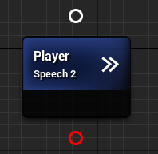
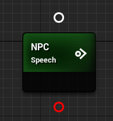

**Click [here](Contents.md) to return to table of contents.** 

# Dialogue Tree: Speech Transitions
A strategy for exiting a [**speech node**](DialogueNodes.md#speech-node) and continuing dialogue. Has extreme importance for the behavior of dialogue. 

## Contents
1. [**Auto-Transitions**](SpeechTransitions.md#1-auto-transition)
2. [**Input-Transitions**](SpeechTransitions.md#2-input-transition)

## 1. Auto-Transition 
A transition that waits for the speech node's audio content to finish playing, or the player to skip, at which point it immediately proceeds to the next node in the chain. Primarily useful for player speech options and for NPC speeches that are chained together without interruption. 
* **Allowed Children:** 1
* **Node Symbol:** >>

## 2. Input-Transition
A transition that presents the node's direct children as a list of options and waits for the player to select one of them before proceeding down the selected branch. Primarily useful for NPC speeches that require a player response. 
* **Allowed Children:** Unlimited
* **Node Symbol:** o>

