**Click [here](Contents.md) to return to the list of tutorials for Dialogue Tree.** 

# Dialogue Tree: Customization Tutorial
This tutorial is also available in video format [**here**](https://youtu.be/5T6BxHAUaB4). 

**Previous:** [**Queries and Events**](QueriesAndEvents.md)

## Help & Support
You can reach me for questions and support at unraedgames@gmail.com, or on the plugin's [**Discord Channel**](https://discord.gg/mf7mGXbePB). Feel free to reach out with any questions or requests. 

If you're enjoying the plugin, I would be extremely grateful if you could take a few moments out of your day to leave me a review on the [**Unreal Marketplace**](https://www.unrealengine.com/marketplace/en-US/product/dialogue-tree). 

If you would like to support further development on the project you can do so on [**Patreon.com**](patreon.com/UnraedGames). 

## Contents
1. [**Introduction**](Customization.md#introduction)
2. [**Customization Overview**](Customization.md#customization-overview)
3. [**Modifying and Replacing Display Widgets**](Customization.md#modifying-and-replacing-display-widgets)
4. [**Customizing the Dialogue Controller**](Customization.md#customizing-the-dialogue-controller)
5. [**Extending the Speaker Component**](Customization.md#extending-the-speaker-component)
5. [**Summary**](Customization.md#summary)

## Introduction
Hi. My name is Zach, and in this tutorial, we’re going to take a look at some of the various ways you can extend Dialogue Tree to customize the look and feel of dialogue in your project.

If you don't already know, Dialogue Tree is a free plugin available on the Unreal Marketplace that offers an easy to use system for creating and editing in game dialogue. 

I’m going to assume that you’ve already looked over the Quick Start guide as well as the tutorials on the Dialogue Editor, and Queries and Events. Those cover much more of the basic operation of the plugin. This one is going to serve as a survey of the various extension points the plugin includes to allow you to tailor it to your needs.

## Customization Overview
Before we get down into the weeds, I want to review a few of the major objects we’ll be talking about.

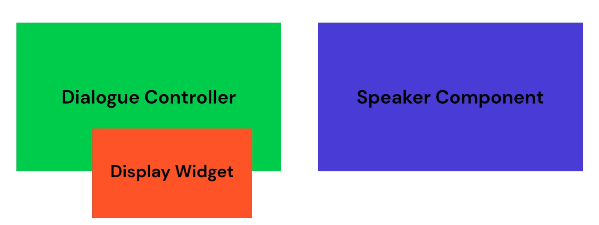

Let’s start with the Dialogue Controller. This is an actor that serves as a kind of bridge between your dialogues and the game world. The Dialogue Controller manages the display of dialogue, and how Speeches and Options are presented. It also serves as a general interface for dialogue interactivity, including the starting and stopping of conversations. For example, when a Speaker Component attempts to start dialogue, what it’s actually doing is redirecting that request to the Dialogue Controller. A huge amount of customization is possible here, up to and including creating your own custom Dialogue Controller. That said, for most users, the included BP_BasicDialogueController will work well with minimal tweaks. 

If you are using the default DialogueController, it makes use of a display widget. Functionally this is just a UMG widget that implements the BI_SimpleDialogueDisplay interface. While the default Dialogue Controller controls the behavior of dialogue in your project, it outsources the actual display to its current Display Widget. This is done to promote flexibility, as the same “basic” dialogue behavior can be displayed to the screen in many ways. Why are display widgets an offshoot of the default Controller and not a required part of the plugin as a whole? Basically, because I could imagine a scenario where you might want to create a custom Controller that bridges its display across multiple widgets, or even bypasses the need for display widgets altogether. Separating things out in this way gives you the option to use the provided display widgets, or not, as you see fit.

Speaker Components are the bridge between your characters and the dialogue. The default option carries standard information that a dialogue might expect to have, but you can extend your Speaker Components to include extra data or functionality however you need. An example of this extension is the provided CRPG Speaker Component, which includes portrait data for the speaker.

## Modifying and Replacing Display Widgets
Two Display Widget options are provided with the plugin.

The default W_BasicDialogueDisplay will be the go-to option for most users. When used with the default Dialogue Controller, this widget creates what I would think of as “standard” dialogue. Think of games like Skyrim, the Witcher, and the Outer Worlds. In practice this means presenting a single NPC speech and a list of options for the player to respond.

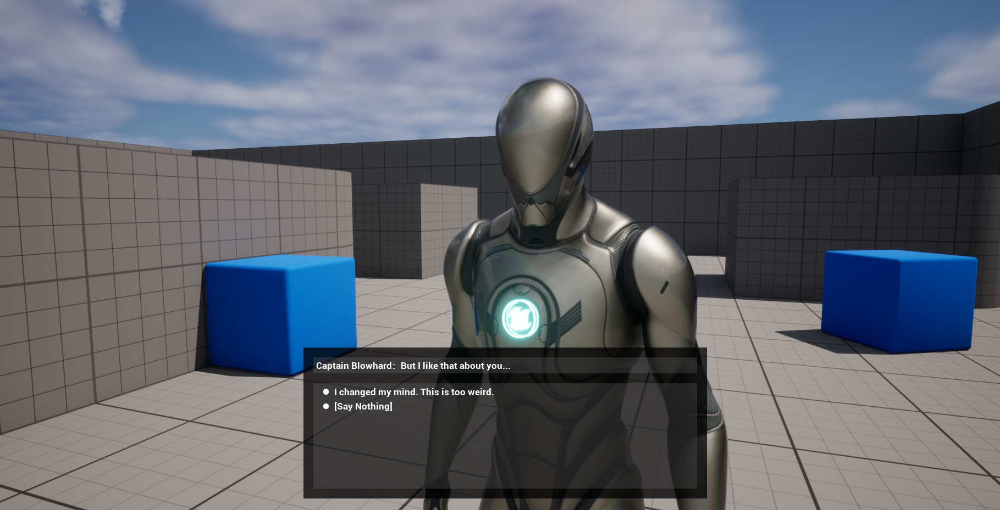

The other provided Display Widget is W_CRPGDialogueDisplay. As the name implies, this adds CRPG staples like portraits and a speech log. To get the most use out of it, CRPG Speaker Components should be used in place of the normal Speaker Components. This will allow you to supply the portraits for your characters on a per-speaker level.

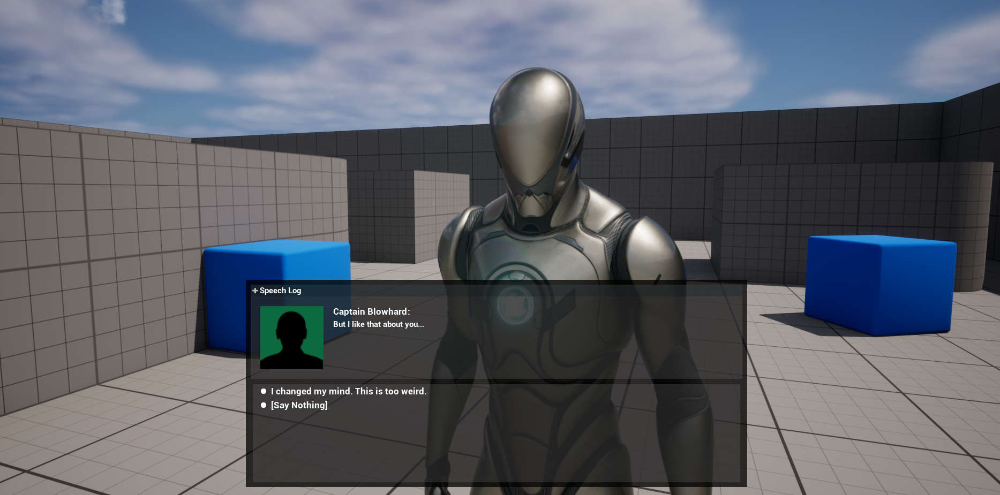

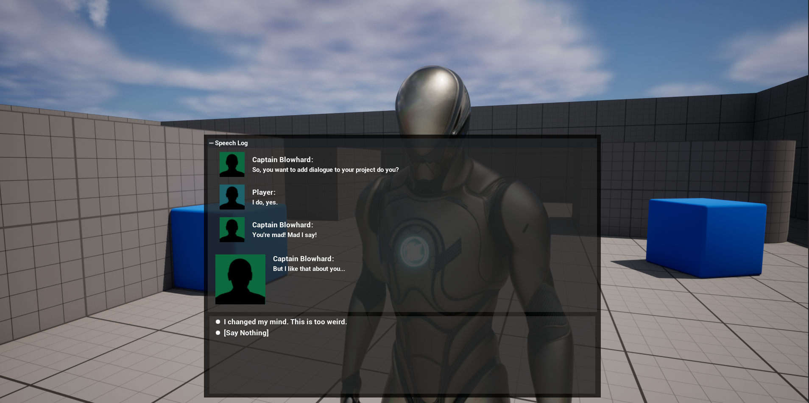

The display widget you use can be set from the Dialogue Controller's details panel. 

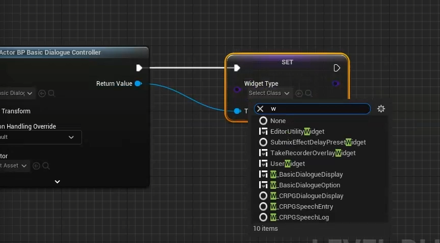

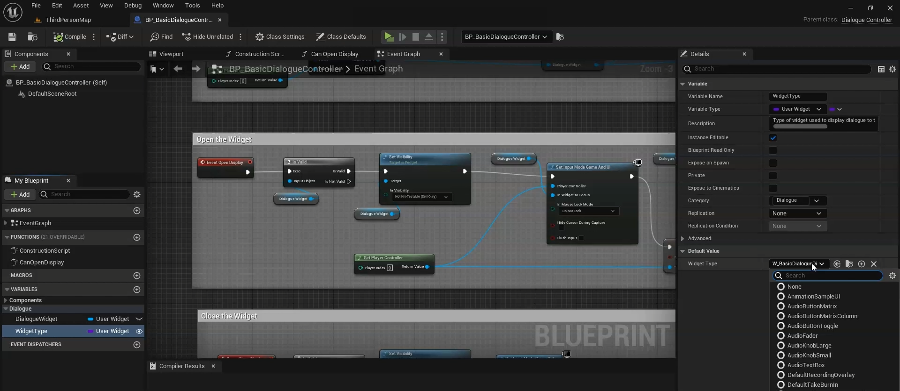

To tweak an existing Display Widget, you just need a basic knowledge of UMG. The provided widgets can be found in the plugin’s content folder under DisplayWidgets and then the Basic and CRPG folders respectively. Opening the widgets up in UMG will allow you to tweak their visuals to your liking.

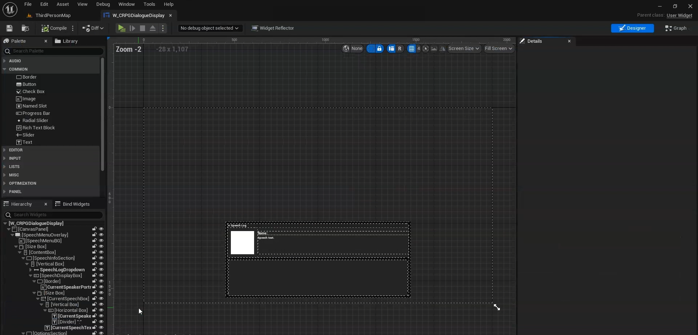

Similarly, you can create your own DisplayWidgets from scratch. Just create a new User Widget and set it to implement the BI_SimpleDialogueDisplay interface. 

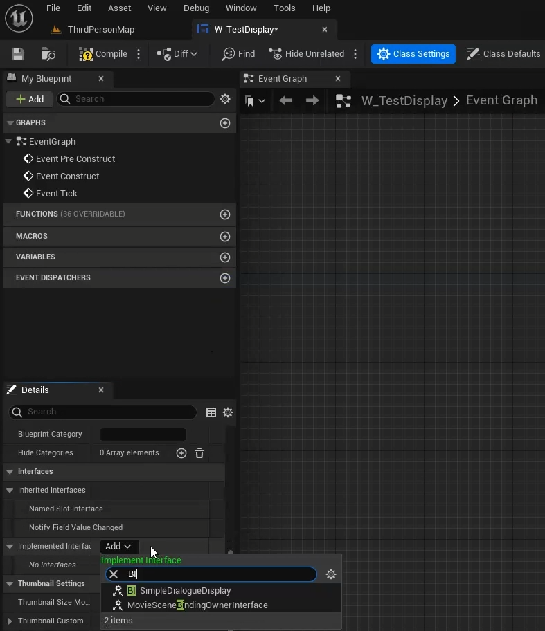

As with all interfaces, that will provide you with several functions to implement to hook your custom widget into the default Dialogue Controller.

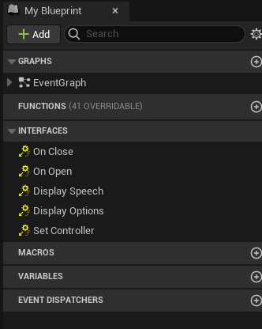

These include:

Set Controller, which takes a Dialogue Controller. This allows your widget to cache a reference to its Dialogue Controller.

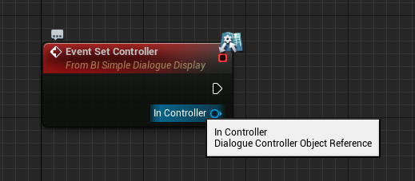

Display Options takes an array of Speech Details structs and allows you to determine how player speech options will display to the screen.

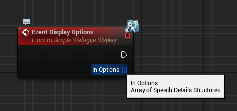

Display Speech takes a single Speech Details struct and a target Speaker Component. It allows you to determine how NPC speeches will display to the screen.

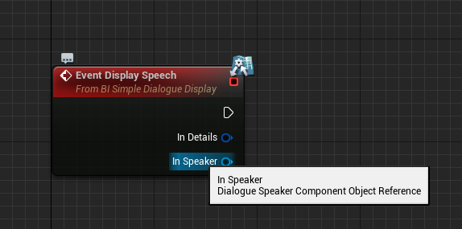

On Open allows you to specify behavior to play on opening the widget.

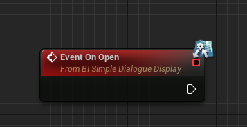

And On Close allows you to specify behavior to play on closing the widget.

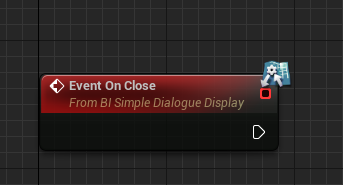

## Customizing the Dialogue Controller
Even if you decide to stick with the default Dialogue Controller, it’s inevitable that you’ll want to tweak it to better fit your needs. So, let’s take a little tour around the controller and how it can be modified.

Up at the top of the event graph, we have the Initialize event, which gets called from BeginPlay.

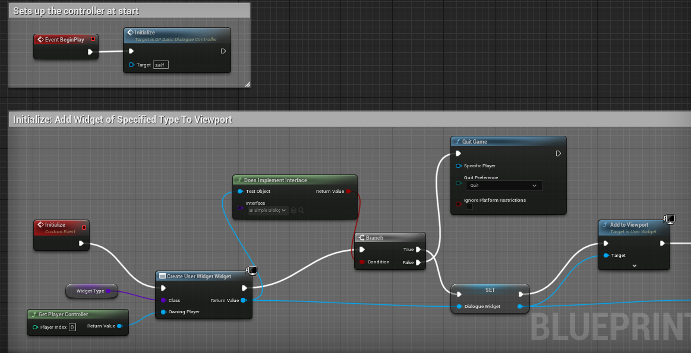

The Initialize function belongs to the default controller specifically, not to the base Dialogue Controller class. If you write your own controller, you may or may not want to include something similar. Essentially all it does is add a Widget of its WidgetType to the screen.

Below that we get into the first of our core Dialogue Controller events, with Open Display. As the name suggests, this opens the display widget and performs associated tasks like changing the input mode.

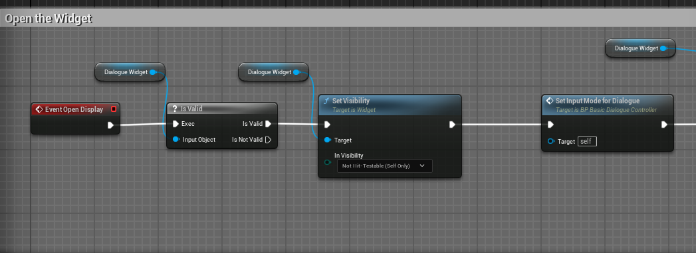

Next up, we have Close Display, which is essentially just the inverse of Open Display. It closes the display widget and performs any associated tasks.

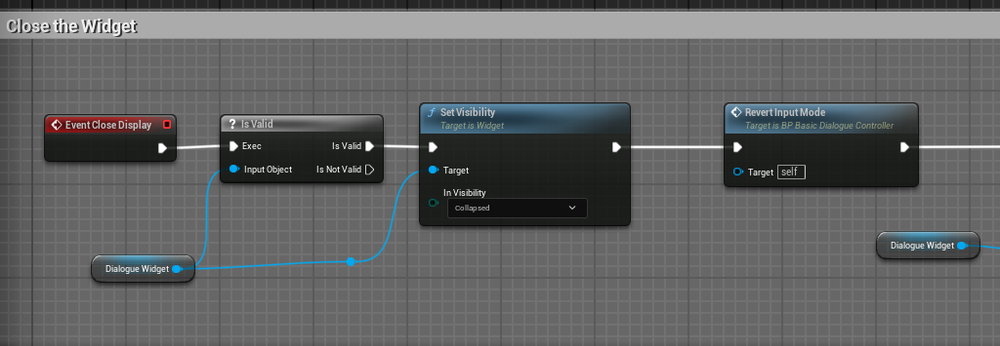

Next, Display Options controls how Player speech options get displayed to the screen. In the case of the default Dialogue Controller, we pass the buck along to the Display Widget.

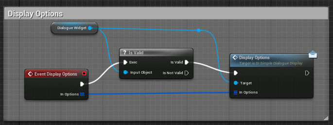

The same goes for Display Speech, which is responsible for displaying an individual speech.

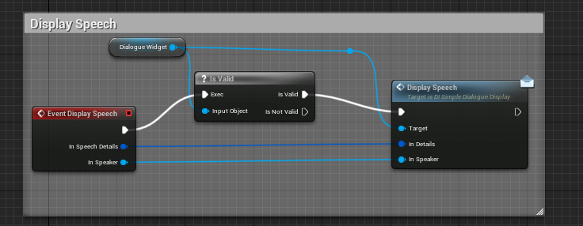

And finally, we have Handle Missing Speaker. This is an optional event to implement. It gets called on starting the dialogue when the Dialogue Tree asset was not provided with one of its expected Speakers. Handle Missing Speaker gives you a first opportunity to address the situation.

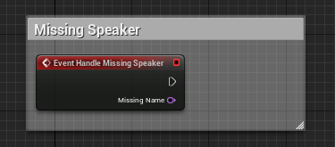

With the possible exceptions of Initialize and Handle Missing Speaker, a custom Dialogue Controller ought to implement each of these events. Your game won’t crash if it doesn’t. Your dialogues just won’t play.

That said, even if you stick with the default Dialogue Controller, there’s a fair amount we can do to customize its functionality. Let’s say, for example, that you want to set up a special dialogue camera that flips back and forth between the various speakers. You could add functionality switching your dialogue camera on and off to the open and close display events. And under the Display Speech event, you could add a function or event call that sets the camera’s orientation based on who’s speaking. Similarly, if you want to hook in a lip sync function, you could tack it on as part of your custom Display Speech implementation. 

The point here is that every user-facing phase of dialogue has some kind of function that you can implement yourself, or otherwise modify to include whatever functionality you need. If none of this works the way you want, you’re able to scrap the default controller and create your own in Blueprint. 

The goal of this design was to create a somewhat modular approach, with default options to take the average user most of the way to a complete setup with minimal effort, but with the flexibility for full customization if it is needed.

## Extending the Speaker Component

The Speaker Component is kind of a special case when it comes to customization, given that we never really want to modify how it does its core job. Often, however, we do want to add extra functionality to help our characters better interact with dialogue. 

We covered this somewhat in the Queries and Events tutorial, where we made a custom Speaker Component with a counter to track how many times the Speaker had asked a question. 

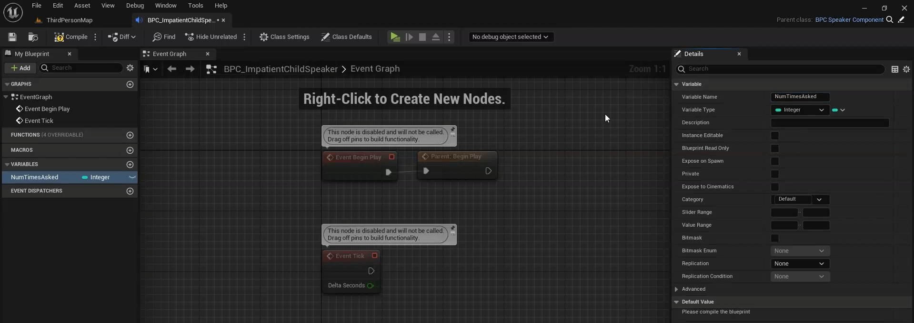

Another good example is in the included CRPG Speaker Component, which includes a Texture property to use as a portrait. 

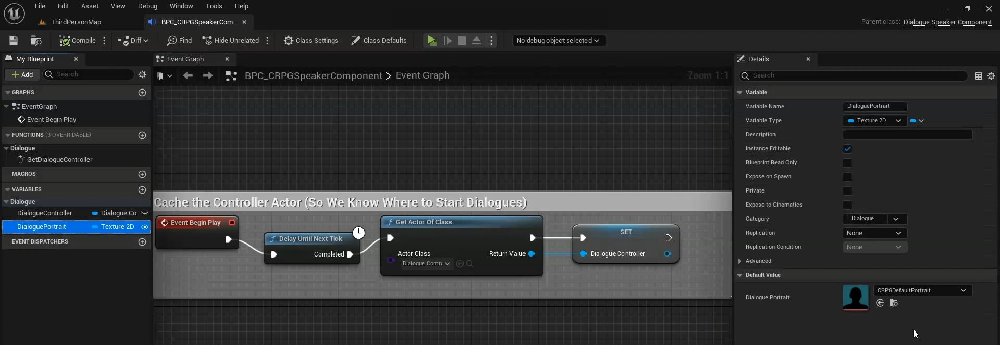

Ultimately, this is very open ended, so there's only so much advice I can offer here. Just know that custom Speaker Components are a good place to stash extra data or to add functionality that will interact with dialogue via Queries or Events.

## Summary
In this tutorial we:

1. Reviewed the major objects that can be extended to customize dialogue in your project. These include the Dialogue Controller, the Display Widget, and the Speaker Components.
2. Discussed how Display Widgets can be modified or replaced to customize the look of dialogue.
3. Discussed how the Dialogue Controller can be modified or replaced to customize the behavior of dialogue on a more fundamental level.
4. Discussed how the Speaker Component can be extended to include additional data and functionality.

This concludes the series of introductory tutorials I had planned to get people up to speed with Dialogue Tree. As a brief review:

1. [**The Quick Start**](QuickStart.md) covers how to get the plugin set up and actually playing dialogue in just a few minutes.
2. [**The Editor Guide**](EditorGuide.md) takes a detailed look at the Dialogue Editor, its nodes, and their properties.
3. [**The Queries and Events Tutorial**](QueriesAndEvents.md) focuses in on how you can create custom Queries and Events to have your dialogues interact with the rest of the game world.
4. And finally, this tutorial explored some of the ways you can customize the plugin to fit your needs.

You should now have a strong foundation for how to use Dialogue Tree in your own projects. I may add more tutorials in future as new features are added and as the need arises. Feel free to reach out if you have any questions, or requests for a specific feature or a tutorial on a specific topic. And if you're enjoying the plugin, I would be beyond grateful if you could take a few seconds out of your day to leave me a review on the [**Unreal Marketplace**](https://www.unrealengine.com/marketplace/en-US/product/dialogue-tree). 

Finally, if you want to support further development on the project, you can do so on [**Patreon.com**](patreon.com/UnraedGames). 

In the meantime, thanks for reading this tutorial. Good luck, and happy developing.