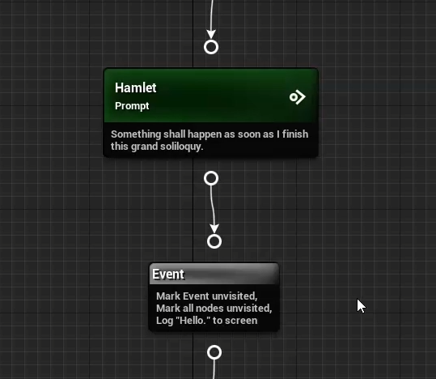

**Click [here](Contents.md) to return to the list of tutorials for Dialogue Tree.** 

# Dialogue Tree: Editor Guide
This tutorial is also available in video format [**here**](https://youtu.be/Amnx4X-0zTk). 

**Previous:** [**Quick Start**](QuickStart.md), **Next:** [**Queries and Events**](QueriesAndEvents.md)

## Help & Support
You can reach me for questions and support at unraedgames@gmail.com, or on the plugin's [**Discord Channel**](https://discord.gg/mf7mGXbePB). Feel free to reach out with any questions or requests. 

If you're enjoying the plugin, I would be extremely grateful if you could take a few moments out of your day to leave me a review on the [**Unreal Marketplace**](https://www.unrealengine.com/marketplace/en-US/product/dialogue-tree). 

If you would like to support further development on the project you can do so on [**Patreon.com**](patreon.com/UnraedGames). 

## Contents
1. [**Introduction**](EditorGuide.md#introduction)
2. [**Graph Properties - Speaking Roles**](EditorGuide.md#graph-properties---speaking-roles)
3. [**Speech Nodes**](EditorGuide.md#speech-nodes)
4. [**Managing Connections Between Nodes**](EditorGuide.md#managing-connections-between-nodes)
5. [**Branch Nodes**](EditorGuide.md#branch-nodes)
6. [**Event Nodes**](EditorGuide.md#event-nodes)
7. [**Jump Nodes**](EditorGuide.md#jump-nodes)
8. [**Compiling**](EditorGuide.md#compiling)
9. [**Summary**](EditorGuide.md#summary)

## Introduction
Hi, my name is Zach, and, in this tutorial, we will be taking a detailed look at the dialogue tree editor and its various features. 

If you don't already know, Dialogue Tree is a free plugin available on the Unreal Marketplace that offers an easy to use system for creating and editing in game dialogue. 

We will be building somewhat off of the topics discussed in the plugin's Quickstart tutorial, so if you haven't already seen that I'd recommend checking it out first. 

When you first open a new dialogue tree asset, you will be faced with a screen that looks something like this.

In the upper left-hand corner, we have the toolbar, where you can compile and save your dialogue.

Below that we have the dialogue graph, where you can edit the flow of dialogue between nodes.

In the upper right, there is the graph properties panel, where we can edit the general properties of the dialogue.

And in the lower right, we have the selection details panel, where we can edit the properties of an individual node.

## Graph Properties - Speaking Roles
Let’s start by taking a closer look at the graph properties panel.

Currently, this panel is primarily used to edit the dialogue’s speakers. You can think of this section as the list of speaking roles for a play. The script doesn’t care who fills the role of Hamlet and Ophelia, for example, it just cares that there is some character it thinks of as Hamlet and some character it thinks of as Ophelia.

This is one of Dialogue Tree’s more important design features. The default method of starting a dialogue will attempt to match Speaker Components to their roles in dialogue according to their “Dialogue Name” property. 

But you can use the StartDialogueWithNames() method to manually match speakers with their desired roles. 

This allows for a great deal of flexibility in determining which actor specifically will fill a given role in dialogue. From the dialogue’s perspective it simply does not matter.

One thing worth noting here is that the plugin expects you to supply the required Speaker Components when playing dialogue. Attempting to play a speech whose associated Speaker Component was not supplied at runtime will cause the dialogue to abort and end the conversation early. More on this in a later tutorial.

Two speakers are created by default: Player and NPC, but we can set their names to be whatever we like. For the sake of argument, I’ll use Hamlet and Ophelia. You can also change the color associated with a speaker in the graph. 

And finally, you can add and remove speakers. As an example, I'll add Claudius and then delete him again. See Hamlet, not so hard. 

## Speech Nodes
With the Speakers out of the way, let’s look at the various nodes you can use to create your dialogue.

At a minimum, there will always be an Entry node in the graph. Its purpose is probably self-explanatory, but for the sake of completeness, it serves as the entry point into your dialogue.

To create a new node, we right click in the graph. That brings up a context menu with options for the various nodes we can create. We’ll go over each of these in turn, but for now let’s start with the workhorse of the dialogue graph: the speech node.

You’ll notice that each speaking role in our dialogue has two different speech node options we can create: one with an input transition, and one with an auto-transition.

Input Transitions play the speech’s content and then wait for the player to select an option from among the node’s children before proceeding down the selected path. These are ideal for NPC speeches which require some kind of response from the player.

Auto-transitions, on the other hand, continue immediately to the next node in the chain as soon as their content is finished playing. Speeches with Auto-transitions are ideal for player speech options, or for chained NPC speeches.

If we create a node for each transition type, you can see that Auto-transitions are marked with a double arrow symbol in the upper right corner, while Input Transitions are marked by a circle and arrow symbol.

We can change a speech’s speaker and transition type at any time via the node’s details panel.

Next let’s look at some other Speech Node properties.

You can think of the **Speech Title** as the name of a speech node. It helps to distinguish one speech from another and serves as an ID for any other nodes which reference the speech.

**Speech Text** is where we set the textual representation of a speech.

**Speech Audio** allows you to select an audio clip to play for the speech.

And **Can Skip** toggles whether the player is allowed to skip the speech’s audio, or if they need to sit through all its content before proceeding.

As a side-note, the actual skipping is achieved by calling the Skip() function on the Dialogue Controller. 

**Behavior Flags** merits special attention. These are tags you can add to a speech as a kind of extra data for the Speaker Component. You can use this data to trigger specific animations on starting a speech, play a special effect, etc. This process is facilitated by a delegate on the Speaker Component which gets called whenever its behavior flags change.

Finally, you may have noticed that I skipped over the **Ignore Content** property. This is a niche option which can be used to stop a node’s content from playing altogether. If Ignore Content is set to true, the speech will proceed as if its content had already finished playing. 

“Why would you want that?” you might ask. Well, let’s say you have a speech node whose only purpose is to allow the player to click, “Continue,” when they’ve finished reading an NPC’s speech. You could give the “Continue” node an Auto-Transition and no audio content. And that would work perfectly unless you decided to also add a speech log. In which case “Continue” would be logged to the speech log as a player response. Which we don’t want. 

Setting “Continue’s” Ignore Content property to true, however, would prevent the node’s text content from playing and being logged. In other words, it can be used to make a speech function as a selectable option, and only an option. 

As I said, it’s a somewhat niche feature, but it has its place in certain setups.

## Managing Connections Between Nodes
Next up, let’s look at how we can manage connections between nodes.

To connect two nodes, we simply have to click and drag from the output pin of one node to the input pin of another, or vice versa.

We can also click and drag from any pin into the graph to create and connect a new node in one go.

If a speech node with an Input Transition has multiple children, those children will become the options the player can select from to proceed.

Note that any output pin without a valid node to transition to turns red. This marks the pin as an exit pin for the dialogue. As the name implies, transitioning out through an exit pin ends the dialogue.

To break a connection between nodes, right click on one of the nodes in question, go to the pin you’re interested in, and click on the connection you want to break.

## Branch Nodes
Now we’ll take a look at the other nodes we can create, starting with Branch Nodes.

We already discussed how dialogue can branch based on the options the player selects. But what if you want to branch your dialogue based on other conditions? That’s where Branch Nodes come in.

Branch nodes allow you to specify any number of custom conditions to branch over. If you add a condition in the details panel, you will be prompted to select a dialogue query for your new condition.

The Node Visited and Speaker Found queries are provided by default. The Node Visited Query allows you to check a specified dialogue node to see if it has already been visited.

The Speaker Found Query allows you to verify that a specified speaking role in dialogue has been filled. 

You can also create your own queries for the dialogue’s speakers by creating a new Blueprint class extending SpeakerQueryBool, SpeakerQueryFloat, or SpeakerQueryInt, and overriding the GetGraphDescription() and QuerySpeaker() functions. 

Queries will be covered in more detail in a later tutorial.

Conditions with queries that return a boolean value will have the “Query True” property, asking if you want to negate the query value. Conditions with queries that return a numeric value will ask you to specify a comparison. In addition, any variables you create as part of your custom queries will appear as properties to fill for the condition.

The “If Any” property allows you to specify if the branch will register as true if any one of its conditions returns true, or if all of them must return true.

On entering a branch node, its conditions are checked. If the conditions evaluate to true, then the branch transitions out through its “If” pin. Otherwise, it transitions out through its “Else” pin.

## Event Nodes
Event nodes are like branch nodes in that they allow you to have your dialogues interact with the game world as a whole. However, where branch nodes attempt to retrieve information from the game world, event nodes attempt to affect it directly.

The ResetNodeVisits and ResetAllNodeVisits events are provided with the plugin. These allow you to mark nodes as unvisited after they've been played, effectively resetting them to their initial state. 

You can create your own custom events by creating a new Blueprint class extending Dialogue Event. You will also want to override GetGraphDescription() and OnPlayEvent(). All dialogue events act through a provided Speaker Component. Like with queries, any variables you create as part of your event will be populated in the details panel for the event node.

You can add as many events as you like to a single event node.

## Jump Nodes
Next up, we have jump nodes.

Imagine you’ve branched your dialogue down a specific pathway, and you want to revert the flow back to the place before the branch occurred. You could manually draw connections back between the pins, but the more such connections you have the messier your graph will become.

Enter the jump node. Simply put, these nodes transfer control to a specified node in the graph. All we need to do is link the jump node where we want it in the graph, and set the jump target in its details panel.

## Compiling
Finally, we have the compile button in the upper left-hand corner of the editor. Before it can be used, a dialogue needs to be compiled. This process essentially takes the dialogue you created in the graph and scrunches it down into something useable. An uncompiled dialogue will refuse to start.

If the dialogue needs to be compiled, the compile button will turn yellow.

If it has been compiled successfully, the compile button will turn green.

If the dialogue has failed to compile, the button will turn red, and any problem nodes will receive a red error banner. The node in question should also display some indication of what the problem is.

A failed compile usually arises from one of two situations:

1. A node requires a speaker that has been removed from the dialogue.
2. Required fields for a dialogue query or event have not been filled out.

## Summary
In this tutorial we took a detailed tour of the Dialogue Tree editor. We covered:

1. The layout of the editor.
2. The role of speakers in dialogue.
3. The properties of speech, branch, event and jump nodes.
4. How to compile your dialogues.

Future tutorials will cover making your own queries and events, as well as how you can further customize the look and feel of dialogue in your project.

If you have any questions or feedback, I'd love to hear from you on my [**discord channel**](https://discord.gg/mf7mGXbePB). And if you're enjoying the plugin, I would be beyond grateful if you could take a few seconds out of your day to leave me a review on the [**Unreal Marketplace**](https://www.unrealengine.com/marketplace/en-US/product/dialogue-tree). 

Finally, if you want to support further development on the project, you can do so on [**Patreon.com**](patreon.com/UnraedGames). 

In the meantime, thanks for reading this tutorial. Best of luck, and happy developing.

**Next:** [**Queries and Events**](QueriesAndEvents.md)