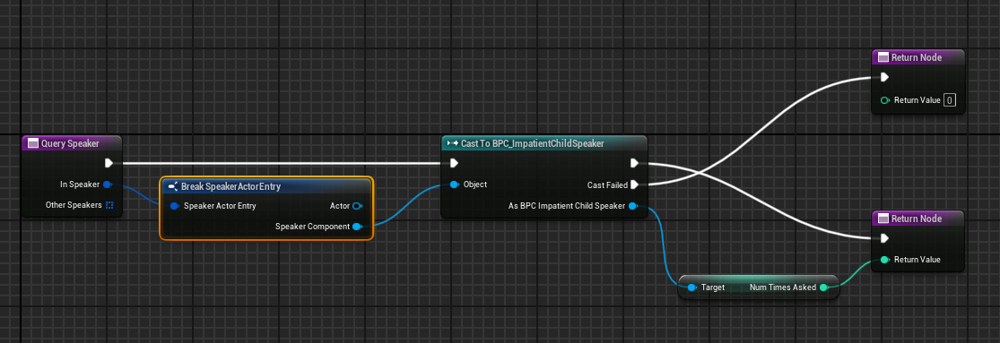
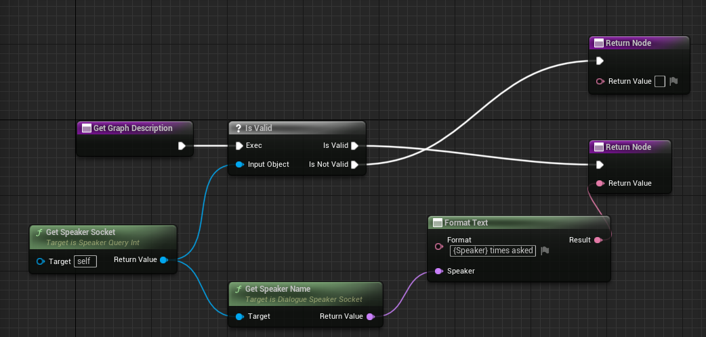
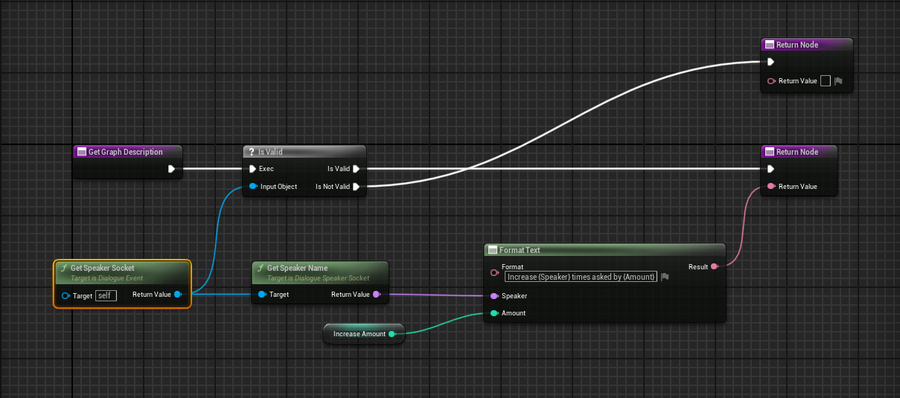
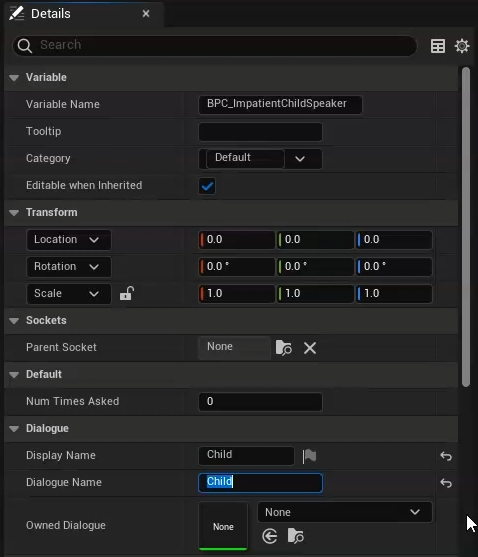

**Click [here](Contents.md) to return to the list of tutorials for Dialogue Tree.** 

# Dialogue Tree: Queries and Events Tutorial
This tutorial is also available in video format [**here**](https://youtu.be/ENdKu6cPi2s). 

**Previous:** [**Editor Guide**](EditorGuide.md),
**Next:** [**Customization Tutorial**](Customization.md)

## Help & Support
You can reach me for questions and support at unraedgames@gmail.com, or on the plugin's [**Discord Channel**](https://discord.gg/mf7mGXbePB). Feel free to reach out with any questions or requests. 

If you're enjoying the plugin, I would be extremely grateful if you could take a few moments out of your day to leave me a review on the [**Unreal Marketplace**](https://www.unrealengine.com/marketplace/en-US/product/dialogue-tree). 

If you would like to support further development on the project you can do so on [**Patreon.com**](https://www.patreon.com/UnraedGames). 

## Contents
1. [**Introduction**](QueriesAndEvents.md#introduction)
2. [**What are Queries and Events?**](QueriesAndEvents.md#what-are-queries-and-events)
3. [**Provided Queries and Events**](QueriesAndEvents.md#provided-queries-and-events)
4. [**An Example Dialogue**](QueriesAndEvents.md#an-example-dialogue)
5. [**Creating a Custom Speaker Component**](QueriesAndEvents.md#creating-a-custom-speaker-component)
6. [**Creating a Custom Dialogue Query**](QueriesAndEvents.md#creating-a-custom-dialogue-query)
7. [**Creating a Custom Dialogue Event**](QueriesAndEvents.md#creating-a-custom-dialogue-event)
8. [**Putting it all Together**](QueriesAndEvents.md#putting-it-all-together)
10. [**Summary**](QueriesAndEvents.md#summary)

## Introduction
Hi. My name is Zach, and in this tutorial for Dialogue Tree we’re going to take a closer look at Dialogue Queries and Events.

If you don't already know, Dialogue Tree is a free plugin available on the Unreal Marketplace that offers an easy to use system for creating and editing in game dialogue. 

We'll start by reviewing what queries and events are, as well as how they fit into the dialogue workflow. We'll then create a short dialogue together that will help us to explore creating our own custom queries and events.

We’ll be picking up from where we left off with the Quick Start and Editor tutorials, so if you haven’t seen those yet I highly recommend you check them out before continuing.

## What are Queries and Events?
Let’s start with a short recap. What are Dialogue Queries and Events, and how do they fit into the dialogue workflow?

To put it simply, Queries and Events are a way for you to let your Game World talk to your dialogues and vice versa.

Taking Queries first, these allow your dialogue to fetch information from the game world. 

Let’s say you’re making a role-playing-game. The player has a bunch of statistics, including Intelligence, and you want to gate certain dialogue options behind a particularly high or low Intelligence. In that situation you could make a Dialogue Query to check the Intelligence score of the player. You could then use that query to branch over the player’s Intelligence score.

Events are the flipside of queries. Rather than fetching information from outside, they use the information in dialogue to do something to the game world. 

Take our role-playing example. Let’s say you want to give the player a quest when they go down a specific path in dialogue. To do this, you would simply make a Dialogue Event to add the quest and add it to an Event Node at the appropriate point in the conversation.

The big point here is that Queries and Events give you the flexibility and control you need to integrate dialogue into the world of your game. If you want information from outside the dialogue, you can make a Query to get it. If you want your dialogue to have an impact beyond the confines of the conversation, you can create an Event with the desired effect.

## Provided Queries and Events
Before we go digging into how we can make our own custom Queries and Events, I want to take a moment to talk about the default Queries provided as part of the plugin. These are slight exceptions to the rule discussed above, in that, rather than retrieve information from outside the dialogue, they retrieve information from the dialogue itself.

First up, we have the Node Visited Query. This one is mostly self-explanatory. It asks you to specify a node in the graph. If that node has already been played in conversation, the Query returns true. Otherwise, it returns false. This is useful for ensuring a key Speech or Event plays only once, or for providing a different Speech on subsequent passes through the conversation.

The Speaker Found Query is a little more complicated. If you think back to the Editor tutorial, you may remember that the Dialogue Tree Asset expects you to provide it with the Speaker Components for its speaking roles. If you don’t provide all the necessary Speaker Components, the dialogue will continue as normal until it encounters a Speech Node whose associated Speaker Component is missing. At that point it will simply end the conversation.

But let’s say you’re making a party-based game, where the player might have a wide variety of different companions with them at any given time. We’ll call one of these companions Juliet. If Juliet is in the player’s party during a particular conversation, we want her to make a comment. But we can’t know beforehand if she’s there.

That’s where the Speaker Found Query comes in. It allows us to check if Juliet’s Speaker Component is present. If it is, we play her Speech. If not, we divert around it to continue the conversation.

There are also a handful of included Events.

Reset Node Visits is the counterpart of the Node Visited Query. This event asks you to specify a node in the graph to mark as unvisited.

Reset All Node Visits is the nuclear version of the same thing. Instead of marking a single node unvisited, it marks every node in the dialogue unvisited, effectively resetting the dialogue to its initial state.

Finally, DLGE_LogToScreen is an event I created to help with debugging. It's the equivalent of Blueprint's PrintString() method, allowing you to log a message to the screen.

## An Example Dialogue 
With that out of the way, let’s look at how we can create our own custom Queries and Events.

To do this we’ll set up a simple dialogue, as pictured here.

The dialogue imagines that the player is a child on a road trip with a parent. Being a creature of great patience, the player will continually ask, “Are we there yet?” The parent will tell the player, “No”.

Little does the parent know that asking if we’re there yet actually does make us get there faster.

When the player has asked 5 times, the answer changes to yes, and the dialogue ends.

Let's take a moment to dig a little deeper into how this dialogue fits together. First up, we have the Parent's introduction. This is just a speech node with an input transition. In other words, the Parent NPC will say the speech and then wait for a response.

The provided response is a speech node with an autotransition. It says, "Are we there yet?" Because it has an autotransition, selecting that response will play the speech and continue on down the chain. There is no audio to play, so we effectively continue immediately.

The next node in line is an Event Node. We'll want to populate this with an event that increases a counter for the number of times the player has asked if we're there yet.

After that we have a branch node. This one will need a custom Query to check if the player has asked enough times. If so, the Parent NPC confirms that we've arrived and a final response allows the player to exit. Otherwise, the parent says we're not there, and a jump node jumps us back up the chain so the player can ask again.

To put this together, we’ll need a Dialogue Query to check how many times the player has asked, and a Dialogue Event to increment that value.

## Creating a Custom Speaker Component
Before we can make a custom query, we need to make sure we have some information to retrieve in the first place. Right click in the content browser and create a new Blueprint class extending BPC_SpeakerComponent. I’ll call mine BPC_ImpatientChildSpeaker.

Opening that new Blueprint graph, we just want to add an integer variable. We’ll call it NumTimesAsked and give it a default value of 0. We’ll also make it public so that we can access it directly.

Compile and save.

## Creating a Custom Dialogue Query
Now it’s time to make our Query.

Right click again in the content browser. Create a new Blueprint class and use one of three base classes depending on what kind of value we want our query to return. Speaker Query Bool returns a Boolean value, Speaker Query Float returns a floating point value, and Speaker Query Int returns an integer value. NumTimesAsked is an integer, so we’ll use Speaker Query Int. I’ll name mine "DLGQ_" for dialogue query, and then "GetTimesAsked."

Open up our new Blueprint Query. The first thing we want to do here is override three functions:

1. Get Graph Description
2. Is Valid Speaker Query
3. Query Speaker

We’ll start with Query Speaker since it’s the simplest of the bunch to explain. This function takes a Speaker Component, which will be supplied from the graph and returns the integer result of the Query.

First, we want to try to cast the provided Speaker Component to our Impatient Child Speaker. If the cast fails, we’ll return 0. If it succeeds, we’ll return the value of NumTimesAsked.

Next let's take a look at Is Valid Speaker Query. This function allows you to protect yourself from bad data. Let's say you create a Query that relies on some code object. What if you forget to supply the required object? Well, then you have a problem. You could very well wind up with unexplained bugs, just like the equivalent situation in Blueprint. 

Is Valid Speaker Query allows you protect yourself from this situation by defining a condition for your Query to compile. If the query is not valid, according to the terms you define, then the dialogue will refuse to compile until the situation is resolved.

In this case, the only value we care about is the Speaker Component. This is checked for validity elsewhere, so we can just return true.

Finally, we have Get Graph Description. This allows us to define the display text associated with our Query in the dialogue graph. Technically speaking you don't have to override this function. By default it will use the class name of your Query as its display text. But its cleaner and more informative to create a custom description.

In this case we want to tell the user that we are checking the times a given Speaker has asked a question.

We'll start by retrieving the speaker socket. Make sure it's valid and get its name.

From there we want to format that into the output text and return. I'll say "{Speaker} times asked."

Now if we open our dialogue asset, we can click on our branch node and add a Condition. Note that the text that appears alongside the condition tells us that it's invalid. That's because we haven't given it the information it needs to do its job. So let's do that.

Set its Query to be our new custom Query.

We'll need to supply the target speaker. And, because our Query returns a numeric value, we'll also need to specify a comparison. In this case, we want to know if the times asked is greater than four.

With that done, the display text should update from "Invalid Condition" to the custom description we provided.

## Creating a Custom Dialogue Event
Creating a custom event is very similar to a custom query, so we’ll take it a little faster.

Start by creating a new Blueprint class that extends Dialogue Event. Give it a name. I’ll call mine "DLGE_" for Dialogue Event, and then "IncreaseTimesAsked." Open up the new Blueprint.

The first thing we want to do here is create an integer variable. I’ll call mine, “IncreaseAmount,” and set its default value to 1. As mentioned earlier, we will be able to edit this variable directly from the dialogue graph.

Next, we want to override On Play Event. This is where we’ll put the actual behavior of our event.

We start by casting the speaker component to our Impatient Child Speaker. Then we increase its NumTimesAsked value by the IncreaseAmount.

Next up, we want to override Is Valid Event. This is the equivalent of Is Valid Query. As before, there isn't any extra information we need to make the Event work, so we can just return true.

Finally we'll override Get Graph Description. Here we want to tell the user that we are increasing the number of times the speaker has asked. We also want to tell them the name of the target speaker and the amount we're increasing by.

Start by getting the speaker socket, and retrieving the speaker's name from there.

Then we want to format that together with our increase amount to produce the output text. I'll say "Increase {Speaker} times asked by {Increase Amount}." And I'll feed in the speaker's name for {Speaker} and the Increase Amount for {Increase Amount}.

Compile and save.

Now we can attach our custom event to our event node in the dialogue graph. As before, the new event will start out telling us it's invalid.

We need to fill in the target Speaker. We could change the value of increase amount, but the default value of 1 that we set earlier is exactly what we want.

With that, the display text changes from "Invalid Event" to our custom description.

Compile and save the dialogue.

## Putting it all Together
Assuming you’re following along from the point we left off in the Quick Start tutorial, we only need to do a couple of things to test our new dialogue.

First, we want to swap out the Speaker Component on the player for the Impatient Child Speaker.

We also want to fill in its display and dialogue name, making the dialogue name “Child” to match the role in dialogue.

Next, we want to open the NPC we created and change its dialogue name to “Parent.” We also need to change its owned dialogue to be our new dialogue.

From there, we can press play and test it out. 

## Summary
In this tutorial we discussed:

1. The purpose of Dialogue Queries and Events.
2. How to use the provided Node Visited Query.
3. How to use the provided Speaker Found Query.
4. How to use the provide Reset Node Visits and Reset All Node Visits Events.
5. How to create your own Dialogue Queries and Events.

Future tutorials will cover how to customize the look and feel of dialogue in your project by extending the plugin.

If you have any questions or feedback, I'd love to hear from you on my [**discord channel**](https://discord.gg/mf7mGXbePB). And if you're enjoying the plugin, I would be beyond grateful if you could take a few seconds out of your day to leave me a review on the [**Unreal Marketplace**](https://www.unrealengine.com/marketplace/en-US/product/dialogue-tree). 

Finally, if you want to support further development on the project, you can do so on [**Patreon.com**](https://www.patreon.com/UnraedGames). 

In the meantime, thanks for reading this tutorial. Best of luck and happy developing.

**Next:** [**Customization Tutorial**](Customization.md)