**Click [here](Contents.md) to return to the list of tutorials for Dialogue Tree.** 

# Dialogue Tree: Quick Start Tutorial
This tutorial is also available in video format [**here**](https://youtu.be/EdDaHHxv-SU). 

**Next:** [**Editor Guide**](EditorGuide.md)

## Help & Support
You can reach me for questions and support at unraedgames@gmail.com, or on the plugin's [**Discord Channel**](https://discord.gg/mf7mGXbePB). Feel free to reach out with any questions or requests. 

If you're enjoying the plugin, I would be extremely grateful if you could take a few moments out of your day to leave me a review on the [**Unreal Marketplace**](https://www.unrealengine.com/marketplace/en-US/product/dialogue-tree). 

If you would like to support further development on the project you can do so on [**Patreon.com**](https://www.patreon.com/UnraedGames). 

## Contents
1. [**Introduction**](QuickStart.md#introduction)
2. [**Key Concepts**](QuickStart.md#key-concepts-and-roadmap)
3. [**Adding the Dialogue Controller**](QuickStart.md#adding-the-dialogue-controller)
4. [**Creating a Dialogue**](QuickStart.md#creating-a-dialogue)
5. [**Adding the Player Speaker Component**](QuickStart.md#adding-the-player-speaker-component)
6. [**Creating an NPC**](QuickStart.md#creating-an-npc)
7. [**Starting Dialogue**](QuickStart.md#starting-dialogue)
8. [**Testing**](QuickStart.md#testing)
9. [**Summary**](QuickStart.md#summary)

## Introduction 
Hi. My name is Zach, and in this tutorial I will be showing you how you can use Dialogue Tree to get dialogue set up in your Unreal 5 project in just a few minutes.

If you don't already know, Dialogue Tree is a free plugin available on the Unreal Marketplace that offers an easy to use system for creating and editing in game dialogue. 

At the end of this tutorial you'll have a simple dialogue up and running that consists of a single NPC speech, and two Player responses.

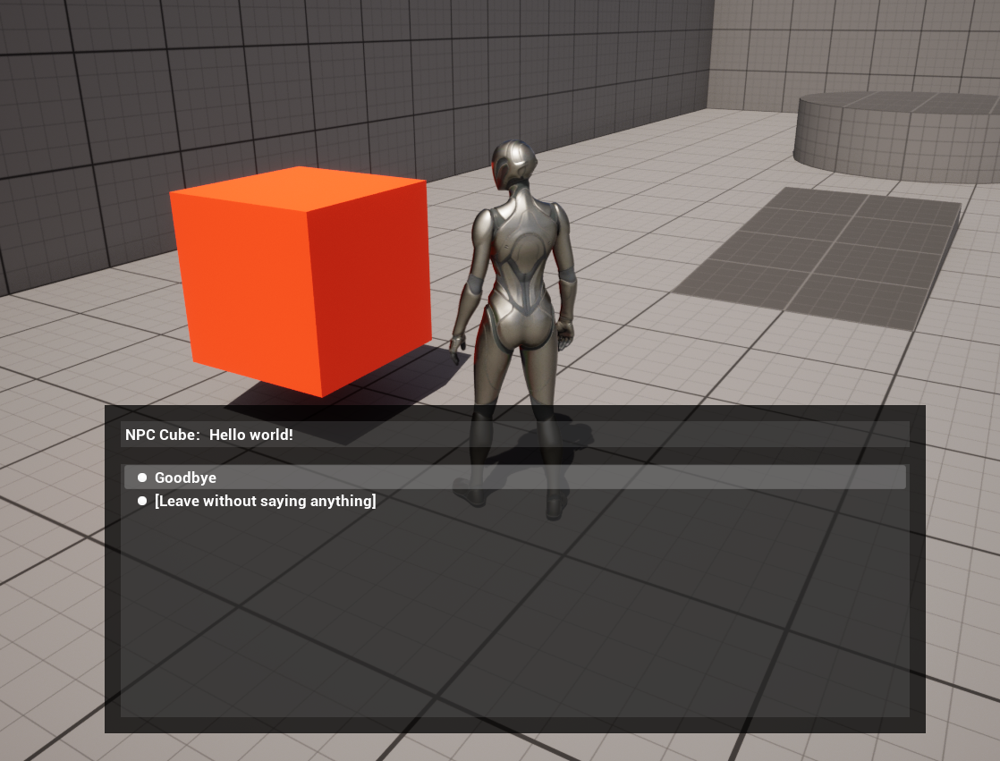

Keep in mind that this is a quickstart tutorial. As such, I'll be keeping explanations to the bare minimum you need to get dialogue up and running. Future tutorials will go into further depth. 

I'll assume a basic knowledge of the Unreal Engine and Blueprint scripting. I'll also assume that you've successfully installed the plugin from your library in the Epic launcher, as normal. I will be using Epic's Third Person Starter Project, but you should be able to follow along with any project you like.  

## Key Concepts and Roadmap
With that out of the way, there are three key objects we'll need to get dialogue set up. 

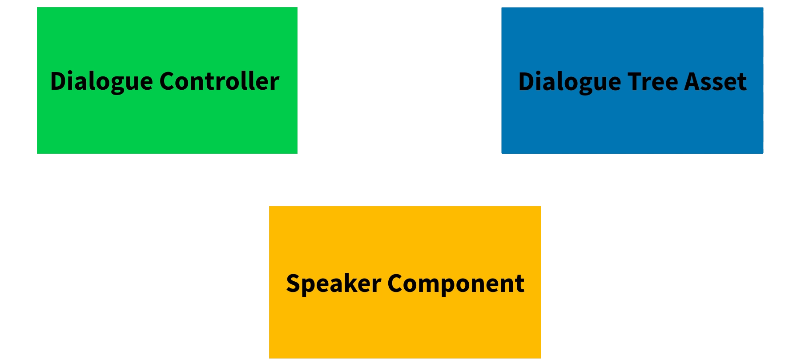

The first one is the Dialogue Controller. You can think of this as the conductor or traffic cop for your dialogue. It essentially governs the look and feel of your dialogue, and what happens when your player interacts with it.  

The second key object is the dialogue asset. This is where you get to write the content of the dialogue itself: who says what and when. 

Finally, we have the Speaker Component, which attaches to your characters and lets them interact 
with your dialogues. 

We'll start by adding a Dialogue Controller to our level, then we'll create a Dialogue, and finally we'll set up our Player and an NPC to get them talking to each other. 

## Adding the Dialogue Controller
The first thing we want to do is add a Dialogue Controller to our level. As mentioned, this actor governs the user-interface for our dialogue.  

You can find the default Controller in the plugin's Content folder under Blueprints>>Controllers. While a whole lot of customization is possible here, for the purposes of this tutorial, we're going to keep everything in its default state. Which means all we need to do here is drag our Controller into the level. 

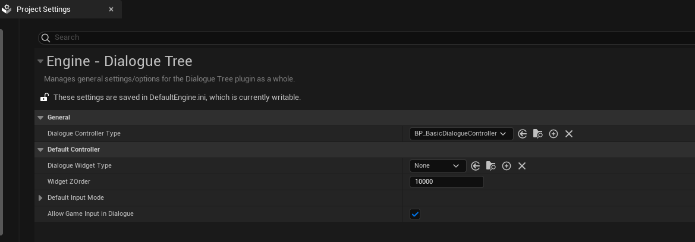

## Creating a Dialogue
Next up we want to create a Dialogue Tree asset. This is where we will define the actual content of a conversation.

Right click in the content browser and select “Dialogue Tree.” I’ll name mine, “DLG_" for Dialogue, and then "TestDialogue.”

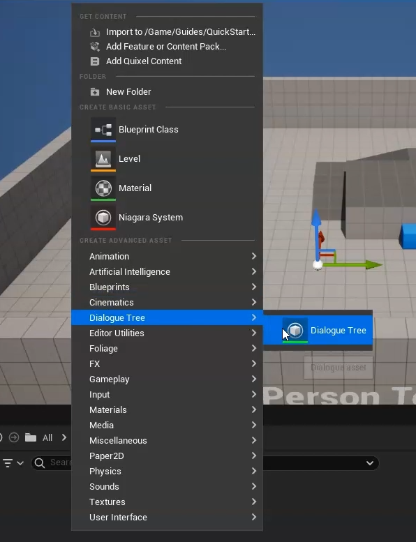

Double clicking on your new dialogue asset will open the Dialogue Tree editor. The details of the editor will be covered in a later tutorial. For now, we’ll stick to the most important points.

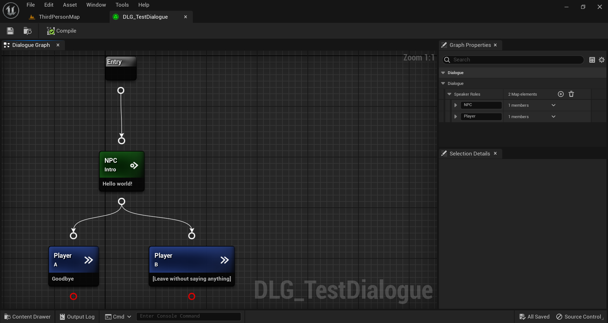

In the upper right-hand panel, you can see the Dialogue’s speakers. This is where you can change the names the Dialogue uses to refer to the various speaking roles in dialogue: the Dramatis Personae, if you're feeling Shakespearean. 

Keep in mind that this "Speaker name" is for internal use by your dialogues. We'll set the display name separately a little later on. 

For the purposes of this tutorial we'll leave the default speakers in place. That means we'll have one speaker we refer to as "Player," and another we refer to as "NPC." 

Let’s create a simple dialogue. Right click in the graph and, under Speech Nodes, select “NPC, Input Transition.” This creates a node which will play its content and then wait for the player to select an option from among its child nodes.

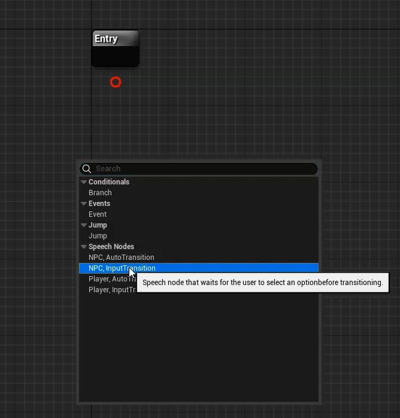

You can give the speech some text from the details panel in the lower right. I’m going to, very creatively, have mine say “Hello World.”

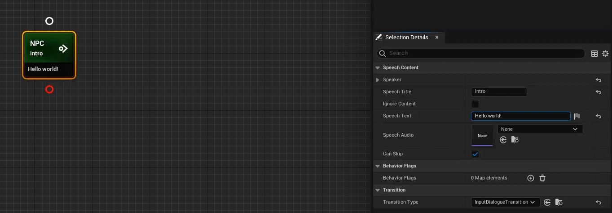

We can link this speech to the Entry node by dragging from the Entry’s output pin onto the speech’s input pin.

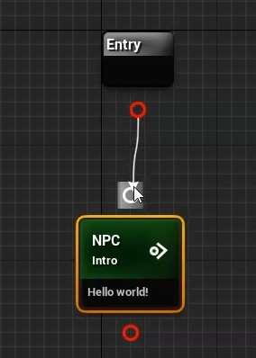

But what good is an NPC speech without the ability to respond? Right click in the graph and add two “Player, Auto-transitions.” Speech nodes with an auto-transition play their content and proceed immediately to the next node in the chain. Perfect for player options. For text, I’ll have the first option say “Goodbye” and the second say “Leave without saying anything.”

You can link these options to the NPC’s speech just like you did before, by clicking and dragging between pins.

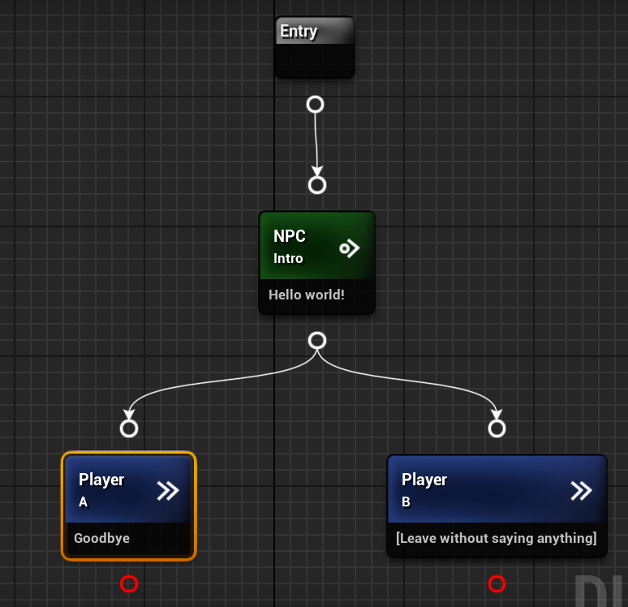

Notice that output pins without a valid node to transition to turn red. This means that transitioning through that pin will exit the dialogue, which is what we want in this case.

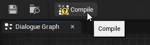

## Adding the Player Speaker Component
We’ve now created our very first dialogue. Let’s get it playing in game. We'll start by adding a Speaker Component to our player character so it can interact with dialogue.

Open the blueprint for your primary player character. In this tutorial I’m using Epic’s Third Person starter project, so I’ll open BP_ThirdPersonCharacter.

In the components panel, click “Add” and select “BPC_SpeakerComponent.” You’ll see a CRPG version as well, which includes portrait data, but we'll just use the basic version right now. 

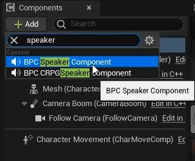

In the speaker component’s details panel, we want to set the Display Name and the Dialogue Name. The Display Name controls how the speaker’s name will appear in text. You can set it to whatever you want.

The Dialogue Name is used when attempting to automatically match the Speaker Component to its role in dialogue. Set this to “Player” to match the name we used in the Dialogue. 

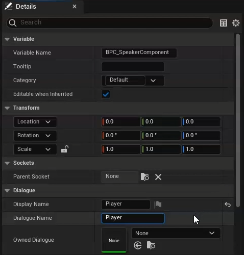

Compile and save.

## Creating an NPC
That’s the player’s speaker component out of the way. But, as the saying goes, it takes two to tango. Let’s create an NPC.

Right click in the content browser and create a new actor blueprint. I’ll name mine BP_NPC.

Open the blueprint editor for the new NPC. The first thing we want to do here, is give our character a mesh so we can see it in game. Add a static mesh component of your choice. I’ll go with a cube, and I’ll make it orange, so it stands out.

Next up, add a speaker component, just like we did with the player. In the details panel, change the speaker component’s Display Name to whatever you’d like, and its Dialogue Name to “NPC” to match its role in the Dialogue. 

The Owned Dialogue field allows you to specify a default Dialogue asset for a speaker component to use. Let’s set this to the DLG_TestDialogue asset we created earlier.

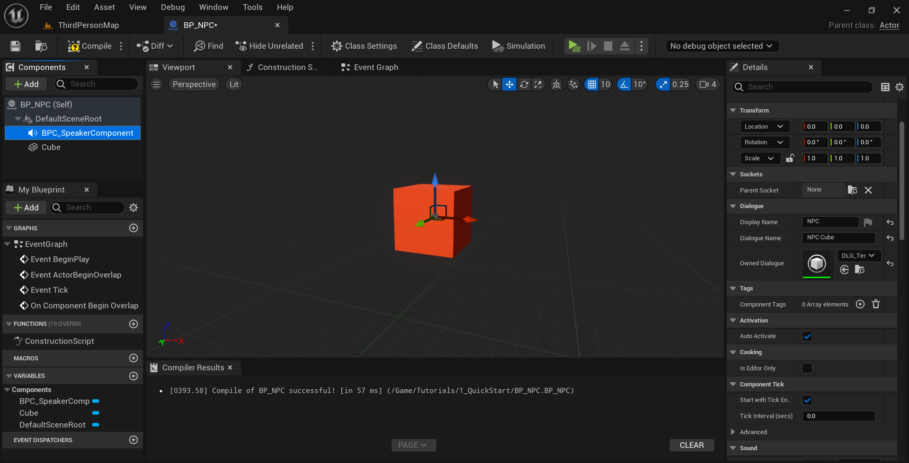

## Starting Dialogue
With that done, we need a way of telling the Controller to start our Dialogue. For this example, we’ll start dialogue whenever the player approaches the NPC. You’ll probably want something more nuanced in your own game, but for demonstration purposes this will do nicely.

Under the NPC’s components, click add, and select sphere collision. Set the sphere’s radius to 150, or whatever you prefer. This is going to be the collider that detects when our player gets close to the NPC. 

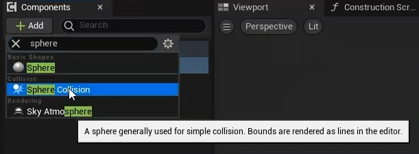

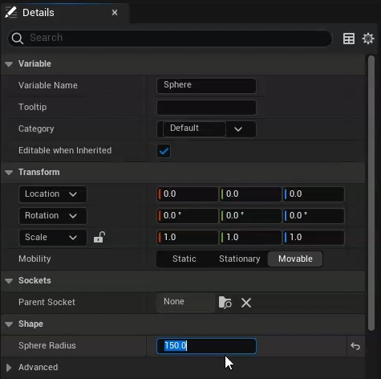

Scrolling down in the sphere collision’s details, click the button to add an “OnComponentBeginOverlap” event.

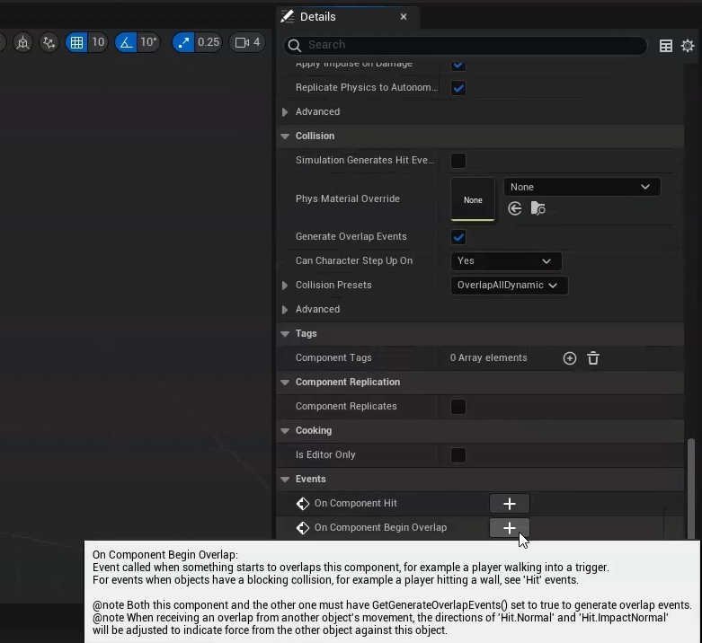

In that event, we’ll first check the overlapped actor for a speaker component using a "GetComponentByClass" node. If that's valid, then we’ll call “StartOwnedDialogue" on the NPC’s speaker component. And we'll pass in both speaker components as an array.

This will start the NPC’s owned dialogue with the NPC and whatever speaker overlapped it, using the two speaker components’ Dialogue Names to match them into their correct roles in dialogue. 

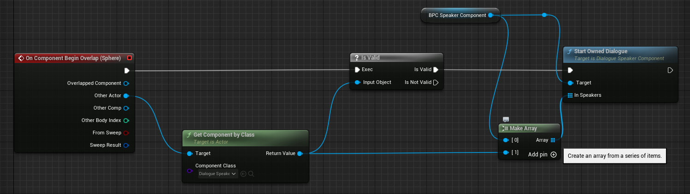

Compile, save, and drag our new NPC actor into the level.

## Testing
All that’s left is to test it. Press play and approach the NPC cube. The dialogue we created should start as soon as we come within range, and close again when we select either option.

## Summary
And that’s all there is to it. To sum up, in this tutorial we covered:

1. How to add a dialogue controller to the level
2. How to create a simple Dialogue Tree asset
3. How to set up Speaker Components
4. And how to get the dialogue to play

Future tutorials will go into greater depth on the Dialogue Tree editor, as well as how you can fully customize the feel and appearance of dialogue. 

I also encourage you to play around with the quickstart dialogue we created here, adding additional speeches and tweaking their properties. 

If you have any questions or feedback, I'd love to hear from you on my [**discord channel**](https://discord.gg/mf7mGXbePB). And if you're enjoying the plugin, I would be beyond grateful if you could take a few seconds out of your day to leave me a review on the [**Unreal Marketplace**](https://www.unrealengine.com/marketplace/en-US/product/dialogue-tree). 

Finally, if you want to support further development on the project, you can do so on [**Patreon.com**](https://www.patreon.com/UnraedGames). 

In the meantime, thanks for reading this tutorial. Good luck and happy developing.

**Next:** [**Editor Guide**](EditorGuide.md)